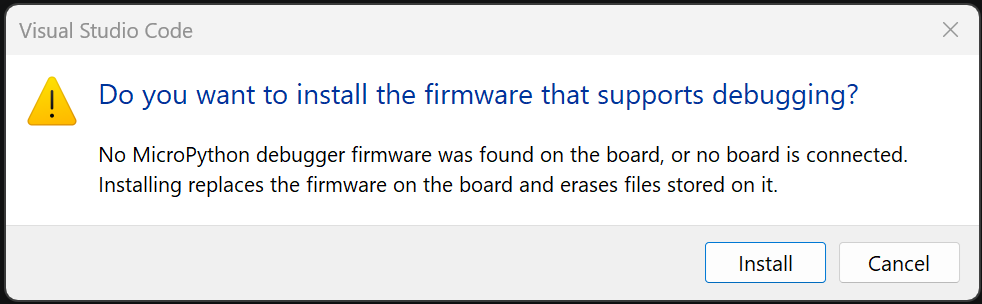
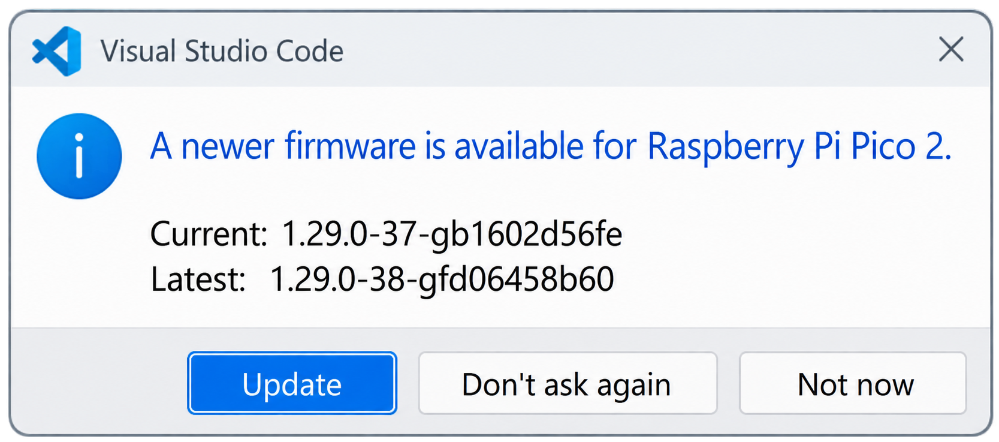

# MicroPython Debugger

**Real source-level debugging for MicroPython, on real hardware, over USB or UART.**

Set a breakpoint in the gutter. Press F5. Your code deploys, the board restarts, and
execution stops on that line — with the call stack, your variables, and a working
Watch window. No JTAG, no debug probe, no wiring. 

- Works over a board's native USB CDC (Pico, ESP32-S2/S3, STM32C071...) 
- Or over a USB-to-serial bridge chip (CP2102/CH340/FTDI on original ESP32 DevKits). 

▶️ [Quick tutorial on YouTube](https://www.youtube.com/watch?v=ED_czSX65UI)


**F5, F10, F11, Shift+F11, restart, stop — the debugger you already know, driving a
microcontroller.** Not a print-and-guess loop, and not a simulator: the real chip, halted
on the real line, with the real values in scope.


*Stopped on a breakpoint on a real board — locals, watch, call stack, and program output all live.*

## What you get

| | |
|---|---|
| **Breakpoints** | Conditional, with hit counts. Anywhere, including inside imported modules. |
| **Step over (F10)** | Run the next line without descending into it. |
| **Step into (F11)** | Follow the call, including into another file. |
| **Step out (Shift+F11)** | Finish the function and stop at the caller. |
| **Continue (F5)** | Run on to the next breakpoint. |
| **Pause** | Interrupt a running program and see where it is. |
| **Restart (Ctrl+Shift+F5)** | Redeploy and start again from the top. |
| **Stop (Shift+F5)** | End the session and leave the board running. |
| **Call stack** | Every frame, with file and line, click to open. |
| **Variables** | Locals *and* globals. Expand lists, dicts and objects, nested. |
| **Watch & hover** | Evaluate any expression in the stopped frame. Hover a name to see its value. |
| **Edit a value** | Change a global while stopped and carry on running. |
| **`print()` output** | Straight into the Debug Console. |
| **Exceptions** | Stops at the line that raised, not after the stack is gone. |
| **Deploy on F5** | Only the files that changed, by CRC. Removes files you deleted locally. |
| **Device console** | Program output live in a terminal, during a debug session or not. |

## Getting started

If you haven't done so, update your board firmware with MicroPython debug support. See **Supported hardware** below.

### If your board has native USB (RP2040, RP2350, Pico, Pico 2, ESP32-S2/S3)

Everything is auto-detected. No launch.json edit needed.

New project:

1. Open VS Code.
2. From the Command Palette (Ctrl+Shift+P), select `MicroPython: New Project`.
3. Choose a location and enter a project name. A new folder with that name is created at the chosen location.
4. Press **F5**... DONE, enjoy!

Existing project:
1. Open the project folder in VS Code
2. Hit **F5** and select `MicroPython`.
3. The extension offers to save a launch configuration afterwards so F5 stops asking.

### If your board uses UART through a USB-to-serial bridge (original ESP32, ESP32-DevKit)

Original ESP32 chips have no native USB, so the board is reached through a bridge chip
(CP2102/CH340/CH9102/FT232). Those chips are generic — an Arduino Nano with a CH340 looks
identical to an ESP32 DevKit with a CH340 — so auto-detect is off for UART. You tell the
extension which port to use, once:

1. Create or open your MicroPython project (steps above).
2. Hit **F5** so the extension saves a `.vscode/launch.json`.
3. Open `.vscode/launch.json` and uncomment three lines, filling in the COM port your
   board shows up as (Windows: `COMx`; Linux/macOS: `/dev/ttyUSB0`):

   ```jsonc
   "debugPort": "COM3",           // "COMx" on Windows, "/dev/ttyUSB0" on Linux/macOS
   "debugInterface": "uart",
   "debugBaud": 115200,           // matches every firmware we ship
   ```

4. Press **F5** — the extension talks the debug protocol over the UART at 115200 baud.

### If your board is STM32C071

STM32C071 has one USB CDC endpoint (no REPL), so you tell the extension which
port to use:

1. Create or open your MicroPython project (steps above).
2. Hit **F5** so the extension saves a `.vscode/launch.json`.
3. Open `.vscode/launch.json` and set `"debugPort"` to the COM port your board
   enumerates as:

   ```jsonc
   "debugPort": "COM3",   // "COMx" on Windows, "/dev/ttyACM0" on Linux/macOS
   ```

4. Press **F5** — DONE.

## Firmware updates

Your board is kept in step with the latest release from GHI Electronics,
helping you stay up to date with fixes and new features.

**First-time install.** On F5 with a board running stock MicroPython (or nothing yet), the
extension offers to install the debugger firmware. Click **Install**, follow the
instruction steps to install firmware into the device.



**Later updates.** Once the debugger firmware is on your board, F5 checks GHI's
public [firmware index on GitHub](https://github.com/ghi-electronics/micropython-vsc-extension/tree/main/docs/firmware)
for a newer release and offers to install it. 



- **Update** — installs the new firmware, then press F5 again to start debugging on it.
- **Not now** — this F5 continues with the current firmware; the check runs again on the next F5.
- **Don't ask again** — the check is disabled for this project by setting
  `"checkFirmwareUpdate": false` in `.vscode/launch.json`. Comments and other fields are preserved.

## Supported hardware

We ship seven firmware builds — between them, they bring the debugger to most popular MicroPython boards today.

| Available firmware | Note |
|---|---|
| [RP2040][fw-rp2040] | For Raspberry Pi Pico and other RP2040 boards. Uses the first 2 MB of flash. Also runs on Pico W (no wireless). |
| [RP2350][fw-rp2350] | For Raspberry Pi Pico 2 and other RP2350 boards. Also runs on Pico 2 W (no wireless). |
| [ESP32_S2_GENERIC][fw-s2] | For ESP32-S2 modules, with or without PSRAM. |
| [ESP32_S3_GENERIC][fw-s3-generic] | For ESP32-S3 modules with no PSRAM or Quad PSRAM. Flash and PSRAM are detected automatically. |
| [ESP32_S3_OCTAL][fw-s3-octal] | For ESP32-S3 modules with Octal PSRAM. Flash and PSRAM are detected automatically. |
| [ESP32_GENERIC_UART0][fw-uart0] | Original ESP32 (no native USB), reached through a USB-to-serial bridge chip. Debug protocol runs over UART0 — requires `debugPort` + `debugInterface: "uart"` in launch.json. |
| [STM32C071_GENERIC_R24F128][fw-stm32c071] | STM32C071 24 KB RAM / 128 KB flash. Single-CDC board: `.py` is compiled to `.mpy` on the host and uploaded to flash on each F5. Flash the firmware itself via USB DFU. |

Run `MicroPython: Update Device Firmware` in the Command Palette, pick the firmware for your board, and follow the instructions.

MicroPython debug support is compiled and tested on the boards below.

| Tested Board | Firmware Used | Note |
|---|---|---|
| Raspberry Pi Pico | RP2040 | |
| Raspberry Pi Pico 2 | RP2350 | |
| Adafruit QT Py ESP32-S2 | ESP32_S2_GENERIC | |
| Seeed XIAO ESP32-S3 | ESP32_S3_GENERIC | No PSRAM on this board. |
| ESP32-S3 N16R8 Development Board | ESP32_S3_OCTAL | 16 MB flash, 8 MB Octal PSRAM. |
| Hosyond ESP32-S3 Touchscreen Module (3.5″) | ESP32_S3_OCTAL | 16 MB flash, 8 MB Octal PSRAM; includes 3.5″ touchscreen. |
| ESP32-PICO-DevKitM (original ESP32) | ESP32_GENERIC_UART0 | CH340-based DevKit, debug over UART0 through the bridge chip. |
| STM32C071KBU6 | STM32C071_GENERIC_R24F128 | Single-CDC; 24KB RAM, 128KB Flash, user code lands as an `.mpy` bundle at every F5. |

### Build firmware for your own board

Not in the list, or want to tune the build for your exact hardware (flash size, PSRAM mode, pin map)? Build the firmware from source — the [MicroPython fork with the debugger integration](https://github.com/ghi-electronics/micropython-firmware-debugger) has the prerequisites, the board-config settings the debugger needs, and per-port notes.

[fw-rp2040]: https://raw.githubusercontent.com/ghi-electronics/micropython-vsc-extension/main/docs/firmware/micropython-rp2040-generic-latest.uf2

[fw-rp2350]: https://raw.githubusercontent.com/ghi-electronics/micropython-vsc-extension/main/docs/firmware/micropython-rp2350-generic-latest.uf2

[fw-s2]: https://raw.githubusercontent.com/ghi-electronics/micropython-vsc-extension/main/docs/firmware/micropython-esp32-s2-generic-latest.bin

[fw-s3-generic]: https://raw.githubusercontent.com/ghi-electronics/micropython-vsc-extension/main/docs/firmware/micropython-esp32-s3-generic-latest.bin

[fw-s3-octal]: https://raw.githubusercontent.com/ghi-electronics/micropython-vsc-extension/main/docs/firmware/micropython-esp32-s3-octal-latest.bin

[fw-uart0]: https://raw.githubusercontent.com/ghi-electronics/micropython-vsc-extension/main/docs/firmware/micropython-esp32-generic-uart0-latest.bin

[fw-stm32c071]: https://raw.githubusercontent.com/ghi-electronics/micropython-vsc-extension/main/docs/firmware/micropython-stm32c071-generic-r24f128-latest.bin

## Commands

| Command | What it does |
|---|---|
| MicroPython: New Project | Scaffolds an empty folder |
| MicroPython: Update Device Firmware | Downloads the right firmware and installs it |
| MicroPython: Flash Firmware from File… | Installs a firmware file you already have |
| MicroPython: Open Device Shell (REPL) | Live program output; Ctrl-C stops the program for a `>>>` prompt |
| MicroPython: Erase Deployed Files | Removes deployed `.py` and `.mpy`, keeps `boot.py` |


**Ctrl+F5** runs without debugging: deploys and runs, `print()` still reaches the Debug
Console, no breakpoints.

## Using libraries

Both `.py` and `.mpy` files are deployed, and **breakpoints work inside a `.mpy`**.

If a `.py` and a `.mpy` exist for the same module, MicroPython imports the `.mpy`, so an
out-of-date one puts breakpoints at the lines it was compiled with. The extension warns
when it sees both.

Data files are deployed only if you list them, since the filesystem is small:

```json
"include": ["data/*.json", "**/*.csv"]
```

## Known limits

- **Non-argument locals need your source.** A module deployed as `.mpy` with no `.py`
  beside it shows its arguments, not its other locals.
- **Caught exceptions do not stop.** Only an exception that would reach the top level
  halts execution; a `try` that would handle it suppresses the stop.
- **`@micropython.native` and `@micropython.viper` cannot be debugged.** They emit no
  trace events, so breakpoints inside them never fire. The code still runs correctly.
- **Threads stop together.** On a board with `_thread`, hitting a breakpoint halts every
  thread, and the stopped frame shown is the one that hit it.
- **The `>>>` prompt needs the program to stop.** MicroPython runs `main.py` to
  completion before starting the REPL, so a program with a loop in it means nothing is
  listening for what you type. Output still appears; Ctrl-C gets you a prompt.
- **First deploy of a large project takes a few seconds.** After that only changed files
  are sent, so an edit-and-run cycle is a fraction of a second.
- **Breakpoints in top-level module code may not fire.** If your `main.py` runs its
  logic directly in a top-level `while True:` loop, breakpoints inside that loop can be
  skipped. Move the loop body into a small function and call it from the loop — the
  breakpoint fires reliably inside the function. Under investigation.
- **ESP32-S3 firmware update fails on Linux.** The extension's flash path aborts
  the handshake during the USB-JTAG reset sequence on Linux only. Install manually
  from the terminal — see the Linux section under Requirements. Windows and macOS
  flash ESP32-S3 normally through the extension.
- **No REPL on UART boards.** UART boards (original ESP32 via CP2102/CH340/FTDI) have
  only one serial line, and the debugger owns it. `Open Device Shell (REPL)` is
  unavailable for these boards.
- **No REPL on STM32C071.** The chip's 24 KB RAM / 128 KB flash budget does not fit
  the REPL alongside the debugger. `Open Device Shell (REPL)` is unavailable for
  STM32C071.

## Requirements

- A device running the MicroPython firmware with debugging support
- VS Code 1.137 or newer

Windows, macOS, Linux and ChromeOS are supported. Everything needed ships inside
the extension — nothing to compile, no toolchain, no Python.

### Windows

Fully supported.

**STM32C071 firmware update.** 

Windows supports DFU but doesn't always install the drivers automatically and may not prompt you to. If you're not sure, install the USB
drivers from [win-usb-dfu.zip](https://github.com/ghi-electronics/micropython-vsc-extension/tree/main/docs/win-usb-dfu-driver/win-usb-dfu.zip).

### macOS

Fully supported, except: STM32C071 F5 needs `mpy-cross` on the machine. Install once with `pip install mpy-cross`.

### Linux

STM32C071 F5 needs `mpy-cross` on the machine. Install once with `pip install mpy-cross`.


Install the udev rule once, then replug the board.

Open a terminal and run:

```bash
cd ~/.vscode/extensions/ghi-electronics.micropython-debugger-<version>
sudo cp udev/99-micropython-debugger.rules /etc/udev/rules.d/
sudo udevadm control --reload-rules && sudo udevadm trigger
```

Replace `<version>` with the version you have installed (for example, `0.1.0`).
Run `ls ~/.vscode/extensions/` to find the exact folder name.

Without it, the board cannot be opened: `/dev/ttyACM*` belongs to the `dialout` group,
and ModemManager probes the debug channel for several seconds after every plug-in.

#### Installing firmware on ESP32-S3

**MicroPython: Update Device Firmware** does not currently work for ESP32-S3
boards on Linux (see Known limits). Install from the terminal instead:

```bash
# 1. Install esptool once, if you do not already have it.
pip install esptool

# 2. Download the current firmware for your board.
#    ESP32-S3 with no PSRAM or Quad PSRAM (e.g. Seeed XIAO ESP32-S3):
wget https://raw.githubusercontent.com/ghi-electronics/micropython-vsc-extension/main/docs/firmware/micropython-esp32-s3-generic-latest.bin
#    ESP32-S3 with Octal PSRAM (N16R8V, N32R8V, or modules ending in "V"):
# wget https://raw.githubusercontent.com/ghi-electronics/micropython-vsc-extension/main/docs/firmware/micropython-esp32-s3-octal-latest.bin

# 3. Put the board in BOOT mode (hold BOOT, tap RESET, release BOOT),
#    confirm which port it appeared as (typically /dev/ttyACM0):
ls /dev/ttyACM*

# 4. Flash it -- adjust the port and the filename to match steps 2 and 3.
esptool.py --chip esp32s3 -p /dev/ttyACM0 --before default_reset --after hard_reset \
    write_flash --flash_mode dio --flash_size keep --flash_freq 80m \
    0x0 micropython-esp32-s3-generic-latest.bin
```

Then tap **RESET** on the board and F5 in VS Code to start debugging.

Raspberry Pi Pico, Pico 2, and ESP32-S2 boards install normally through the
extension on Linux -- only ESP32-S3 needs this manual step.

### ChromeOS

Automatic firmware updates through the extension are not supported on
ChromeOS. Install firmware manually using the terminal commands shown in
the Linux section above.

Once the firmware is running, enable USB pass-through for your board in
ChromeOS **Settings → About ChromeOS → Developers → Linux → Manage USB
devices**, then pin the debug port in `.vscode/launch.json`:

```jsonc
"debugPort": "/dev/ttyACM1"
```

Auto-detect does not work in Crostini because pass-through USB devices carry
no VID/PID metadata. The exact port name may differ; find yours with
`ls /dev/ttyACM*` — the debugger firmware exposes two ports, and the
higher-numbered one is the debug channel.

---

## About GHI Electronics

GHI Electronics is an embedded hardware and software company. We build the tools that
make embedded development approachable — MicroPython here, and C# and .NET on our
[TinyCLR](https://www.ghielectronics.com/tinyclr/) platform, which has been debugging
production embedded devices for years. This extension brings the same proven debugger
protocol to MicroPython, so the source-level experience you expect on a desktop works
on a small board too.

If you are new to GHI Electronics, take a look at our embedded devices and see where
MicroPython fits alongside our C#/.NET platform:

| | |
|---|---|
| Website | [www.ghielectronics.com](https://www.ghielectronics.com) |
| Support | [support@ghielectronics.com](mailto:support@ghielectronics.com) |
| Forum | [forums.ghielectronics.com](https://forums.ghielectronics.com/) |
