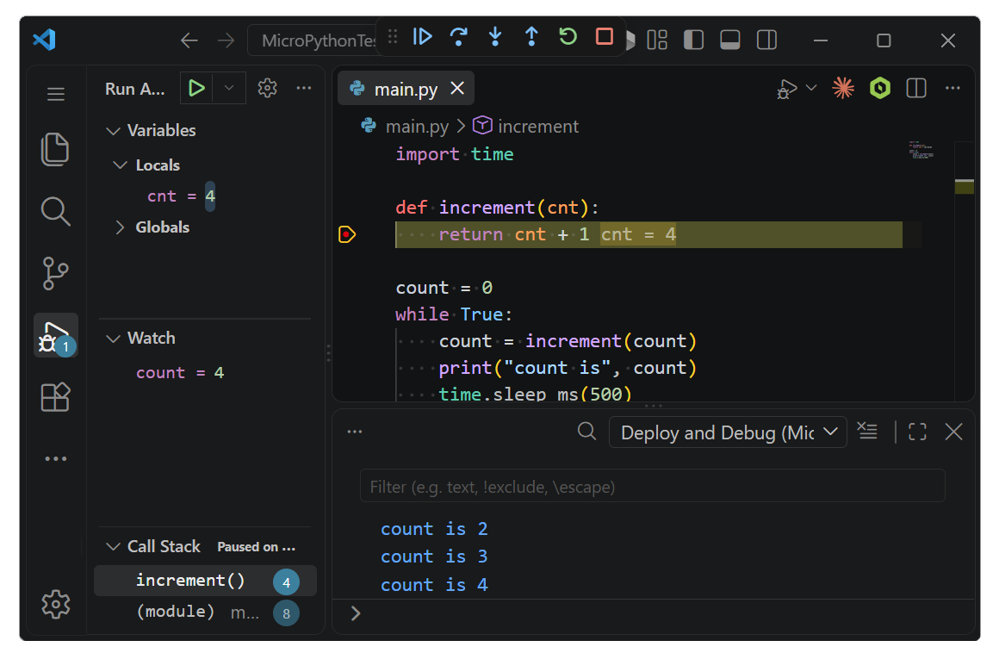

# MicroPython Debugger

**Real source-level debugging for MicroPython, on real hardware, over one USB cable.**

Set a breakpoint in the gutter. Press F5. Your code deploys, the board restarts, and
execution stops on that line — with the call stack, your variables, and a working
Watch window. No JTAG, no debug probe, no wiring.


**F5, F10, F11, Shift+F11, restart, stop — the debugger you already know, driving a
microcontroller.** Not a print-and-guess loop, and not a simulator: the real chip, halted
on the real line, with the real values in scope.



*Stopped on a breakpoint on a real board — locals, watch, call stack, and program output all live.*

## What you get

| | |
|---|---|
| **Breakpoints** | Conditional, with hit counts. Anywhere, including inside imported modules. |
| **Step over (F10)** | Run the next line without descending into it. |
| **Step into (F11)** | Follow the call, including into another file. |
| **Step out (Shift+F11)** | Finish the function and stop at the caller. |
| **Continue (F5)** | Run on to the next breakpoint. |
| **Pause** | Interrupt a running program and see where it is. |
| **Restart (Ctrl+Shift+F5)** | Redeploy and start again from the top. |
| **Stop (Shift+F5)** | End the session and leave the board running. |
| **Call stack** | Every frame, with file and line, click to open. |
| **Variables** | Locals *and* globals. Expand lists, dicts and objects, nested. |
| **Watch & hover** | Evaluate any expression in the stopped frame. Hover a name to see its value. |
| **Edit a value** | Change a global while stopped and carry on running. |
| **`print()` output** | Straight into the Debug Console. |
| **Exceptions** | Stops at the line that raised, not after the stack is gone. |
| **Deploy on F5** | Only the files that changed, by CRC. Removes files you deleted locally. |
| **Device console** | Program output live in a terminal, during a debug session or not. |

## Getting started

If you haven't done so, update your board firmware with MicroPython debug support. See **Supported hardware** below.

New project:

1. Open VS Code.
2. From the Command Palette (Ctrl+Shift+P), select `MicroPython: New Project`.
3. Choose a location and enter a project name. A new folder with that name is created at the chosen location.
4. Press **F5**... DONE, enjoy!

Existing project:
1. Open the project folder in VS Code
2. Hit **F5** and select `MicroPython`.
3. The extension offers to save a launch configuration afterwards so F5 stops asking.

## Supported hardware

MicroPython debug support is compiled and tested on some boards for you. 

Run `MicroPython: Update Device Firmware` in the Command Palette, pick your board, and follow the instructions.

You can also download the firmware and flash it yourself. Click on the desired board in the table below to download the firmware.

| Chip | Available Firmware |
|---|---|
| **RP2040** | [Raspberry Pi Pico][pico], [Adafruit QT Py RP2040][qtpy-rp2040] |
| **RP2350** | [Raspberry Pi Pico 2][pico2] |
| **ESP32-S2** | [Adafruit QT Py ESP32-S2 and generic ESP32-S2 modules][esp32-s2] |
| **ESP32-S3** | [ESP32-S3 N16R8 Development Board][esp32-s3-octal], [Seeed XIAO ESP32-S3][xiao-s3], [Hosyond ESP32-S3 Touchscreen Module (3.5″)][esp32-s3-octal] |


[pico]: https://raw.githubusercontent.com/ghi-electronics/micropython-vsc-extension/main/docs/firmware/micropython-rpi-pico-v1.29.0-34-gf7cdef69c8.uf2
[pico2]: https://raw.githubusercontent.com/ghi-electronics/micropython-vsc-extension/main/docs/firmware/micropython-rpi-pico2-v1.29.0-34-gf7cdef69c8.uf2
[qtpy-rp2040]: https://raw.githubusercontent.com/ghi-electronics/micropython-vsc-extension/main/docs/firmware/micropython-qtpy-rp2040-v1.29.0-34-gf7cdef69c8.uf2
[esp32-s2]: https://raw.githubusercontent.com/ghi-electronics/micropython-vsc-extension/main/docs/firmware/micropython-esp32-s2-v1.29.0-34-gf7cdef69c8.bin
[xiao-s3]: https://raw.githubusercontent.com/ghi-electronics/micropython-vsc-extension/main/docs/firmware/micropython-xiao-esp32s3-v1.29.0-34-gf7cdef69c8.bin
[esp32-s3-octal]: https://raw.githubusercontent.com/ghi-electronics/micropython-vsc-extension/main/docs/firmware/micropython-esp32-s3-octal-psram-v1.29.0-34-gf7cdef69c8.bin

## Commands

| Command | What it does |
|---|---|
| MicroPython: Update Device Firmware | Downloads the right firmware and installs it |
| MicroPython: Flash Firmware from File… | Installs a firmware file you already have |
| MicroPython: Open Device Shell (REPL) | Live program output; Ctrl-C stops the program for a `>>>` prompt |
| MicroPython: Device Info | Firmware protocol version, limits, filesystem usage |
| MicroPython: Erase Deployed Files | Removes deployed `.py` and `.mpy`, keeps `boot.py` |
| MicroPython: New Project | Scaffolds an empty folder |
| MicroPython: Select Device | Choose the port when more than one board is attached |

**Ctrl+F5** runs without debugging: deploys and runs, `print()` still reaches the Debug
Console, no breakpoints.

## Using libraries

Both `.py` and `.mpy` files are deployed, and **breakpoints work inside a `.mpy`**.

If a `.py` and a `.mpy` exist for the same module, MicroPython imports the `.mpy`, so an
out-of-date one puts breakpoints at the lines it was compiled with. The extension warns
when it sees both.

Data files are deployed only if you list them, since the filesystem is small:

```json
"include": ["data/*.json", "**/*.csv"]
```

## Known limits

- **Non-argument locals need your source.** A module deployed as `.mpy` with no `.py`
  beside it shows its arguments, not its other locals.
- **Caught exceptions do not stop.** Only an exception that would reach the top level
  halts execution; a `try` that would handle it suppresses the stop.
- **`@micropython.native` and `@micropython.viper` cannot be debugged.** They emit no
  trace events, so breakpoints inside them never fire. The code still runs correctly.
- **Threads stop together.** On a board with `_thread`, hitting a breakpoint halts every
  thread, and the stopped frame shown is the one that hit it.
- **The `>>>` prompt needs the program to stop.** MicroPython runs `main.py` to
  completion before starting the REPL, so a program with a loop in it means nothing is
  listening for what you type. Output still appears; Ctrl-C gets you a prompt.
- **First deploy of a large project takes a few seconds.** After that only changed files
  are sent, so an edit-and-run cycle is a fraction of a second.
- **Breakpoints in top-level module code may not fire.** If your `main.py` runs its
  logic directly in a top-level `while True:` loop, breakpoints inside that loop can be
  skipped. Move the loop body into a small function and call it from the loop — the
  breakpoint fires reliably inside the function. Under investigation.
- **ESP32-S3 firmware update fails on Linux.** The extension's flash path aborts
  the handshake during the USB-JTAG reset sequence on Linux. Install manually from
  the terminal — see the Linux section under Requirements. Other boards and other
  platforms are unaffected.

## Requirements

- A device running the MicroPython firmware with debugging support
- VS Code 1.137 or newer

Windows, Linux are all supported, and everything needed ships inside the
extension — nothing to compile, no toolchain, no Python.

### Linux only

Install the udev rule once, then replug the board.

Open a terminal and run:

```bash
cd ~/.vscode/extensions/ghi-electronics.micropython-debugger-<version>
sudo cp udev/99-micropython-debugger.rules /etc/udev/rules.d/
sudo udevadm control --reload-rules && sudo udevadm trigger
```

Replace `<version>` with the version you have installed (for example, `0.1.0`).
Run `ls ~/.vscode/extensions/` to find the exact folder name.

Without it, the board cannot be opened: `/dev/ttyACM*` belongs to the `dialout` group,
and ModemManager probes the debug channel for several seconds after every plug-in.
Windows and macOS need nothing.

#### Installing firmware on ESP32-S3 (Linux only)

**MicroPython: Update Device Firmware** does not currently work for ESP32-S3
boards on Linux (see Known limits). Install from the terminal instead:

```bash
# 1. Install esptool once, if you do not already have it.
pip install esptool

# 2. Download the current firmware for your board.
#    XIAO ESP32-S3:
wget https://raw.githubusercontent.com/ghi-electronics/micropython-vsc-extension/main/docs/firmware/micropython-xiao-esp32s3-v1.29.0-34-gf7cdef69c8.bin
#    Generic ESP32-S3 with 8 MB octal PSRAM (N8R8, N16R8):
# wget https://raw.githubusercontent.com/ghi-electronics/micropython-vsc-extension/main/docs/firmware/micropython-esp32-s3-octal-psram-v1.29.0-34-gf7cdef69c8.bin

# 3. Put the board in BOOT mode (hold BOOT, tap RESET, release BOOT),
#    confirm which port it appeared as (typically /dev/ttyACM0):
ls /dev/ttyACM*

# 4. Flash it -- adjust the port and the filename to match steps 2 and 3.
esptool.py --chip esp32s3 -p /dev/ttyACM0 --before default_reset --after hard_reset \
    write_flash --flash_mode dio --flash_size keep --flash_freq 80m \
    0x0 micropython-xiao-esp32s3-v1.29.0-34-gf7cdef69c8.bin
```

Then tap **RESET** on the board and F5 in VS Code to start debugging.

Raspberry Pi Pico, Pico 2, QT Py RP2040, and ESP32-S2 boards install normally
through the extension on Linux -- only ESP32-S3 needs this manual step.

---

## About GHI Electronics

GHI Electronics is an embedded hardware and software company. We build the tools that
make embedded development approachable — MicroPython here, and C# and .NET on our
[TinyCLR](https://www.ghielectronics.com/tinyclr/) platform, which has been debugging
production embedded devices for years. This extension brings the same proven debugger
protocol to MicroPython, so the source-level experience you expect on a desktop works
on a small board too.

If you are new to GHI Electronics, take a look at our embedded devices and see where
MicroPython fits alongside our C#/.NET platform:

| | |
|---|---|
| Website | [www.ghielectronics.com](https://www.ghielectronics.com) |
| Support | [support@ghielectronics.com](mailto:support@ghielectronics.com) |
| Forum | [forums.ghielectronics.com](https://forums.ghielectronics.com/) |
